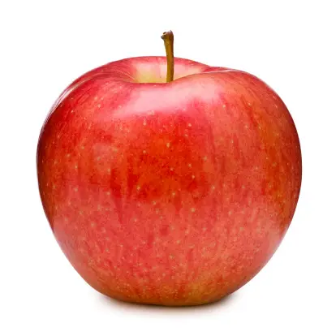
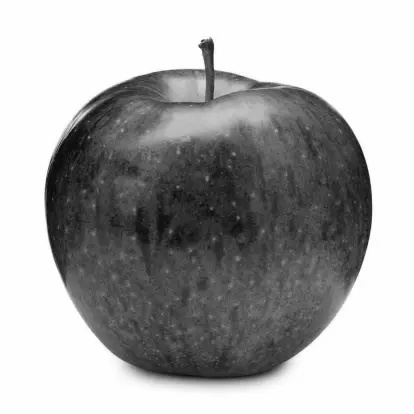
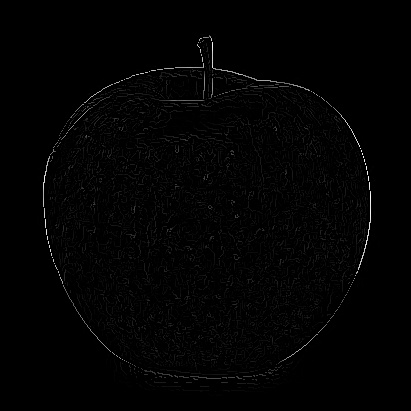
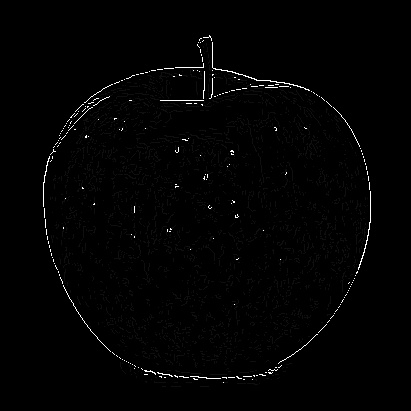

# Edge Detection Project: Canny Edge Detection

## Overview

This project implements the Canny edge detection algorithm, which involves converting a color image to grayscale, applying a Gaussian filter, calculating gradients, and performing non-maximum suppression.

## Requirements

- Python 3.x
- OpenCV (`cv2`)
- NumPy

Install the required packages with: pip install opencv-python numpy

## Usage

1. Place the input image file (`a_image.webp`) in the project directory.
2. Run the script `edge_detection.py`.
3. Output images generated:
   - `b_gray_scale.jpg`: Grayscale image.
   - `c_gf_applied_image.jpg`: Image after applying Gaussian filter.
   - `d_gradient.jpg`: Gradient magnitude image.
   - `e_after_nm_suppression.jpg`: Image after non-maximum suppression.
   - `f_canny_edge_image.jpg`: Final Canny edge detected image.

## Results

Performance metrics:
- **Gradient Magnitude**
- **Non-Maximum Suppression Results**
- **Canny Edge Image**

### Sample Images

- **Original Image**
  

- **Grayscale Image**
  

- **Gaussian Filter Applied Image**
  

- **Gradient Magnitude Image**
  

- **After Non-Maximum Suppression**
  

- **Canny Edge Image**
  

## Conclusion

This project illustrates the steps involved in the Canny edge detection algorithm, showcasing techniques such as grayscale conversion, Gaussian filtering, gradient calculation, and non-maximum suppression.

